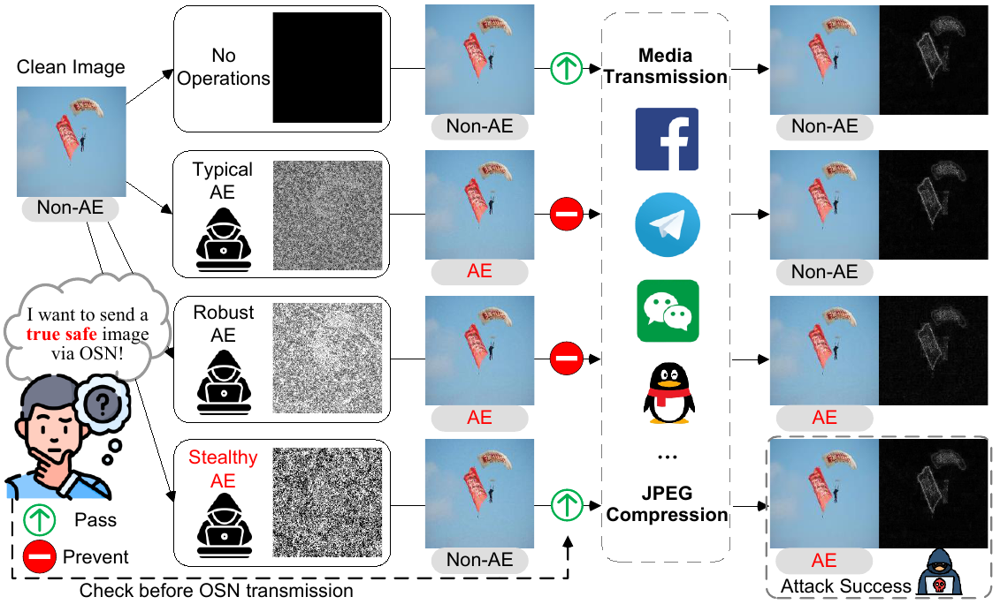

# Stealthy-AE: Generating Stealthy Adversarial Examples through Online Social Networks

We introduce the concept of stealthy adversarial examples (AE), which is benign before transmission through Online Social Networks (OSNs) but becomes adversarial after processing. The inherent transformations applied by OSNs, such as image compression and format conversion, can activate the properties of adversarial examples that are originally hidden. We present a suite of stealthy AE generation frameworks. Subsequently, our scheme involves the quality factor calculation, leveraging the diffusion model with differential JPEG layers to simulate OSN transmission, and utilizing the Lagrange multiplier method for AE generation optimization. 



## Requirements

```bash
pip install Pillow
pip install torch
pip install torchvision
pip install torchattacks
```

## Source Code

The code to compute quality factor is stored in ./code/utils.py. The standard quantization tables for luminance (table 0) and chrominance (table 1) are defined based on the JPEG standard (ISO/IEC 10918-1). Details of the tables are as follows. 

$$
t_0 = \begin{pmatrix}
16 & 11 & 10 & 16 & 24 & 40 & 51 & 61 \\
12 & 12 & 14 & 19 & 26 & 58 & 60 & 55 \\
14 & 13 & 16 & 24 & 40 & 57 & 69 & 56 \\
14 & 17 & 22 & 29 & 51 & 87 & 80 & 62 \\
18 & 22 & 37 & 56 & 68 & 109 & 103 & 77 \\
24 & 35 & 55 & 64 & 81 & 104 & 113 & 92 \\
49 & 64 & 78 & 87 & 103 & 121 & 120 & 101 \\
72 & 92 & 95 & 98 & 112 & 100 & 103 & 99
\end{pmatrix}
$$

$$
t_1 = \begin{pmatrix}
17 & 18 & 24 & 47 & 99 & 99 & 99 & 99 \\
18 & 21 & 26 & 66 & 99 & 99 & 99 & 99 \\
24 & 26 & 56 & 99 & 99 & 99 & 99 & 99 \\
47 & 66 & 99 & 99 & 99 & 99 & 99 & 99 \\
99 & 99 & 99 & 99 & 99 & 99 & 99 & 99 \\
99 & 99 & 99 & 99 & 99 & 99 & 99 & 99 \\
99 & 99 & 99 & 99 & 99 & 99 & 99 & 99 \\
99 & 99 & 99 & 99 & 99 & 99 & 99 & 99
\end{pmatrix}
$$

The "code" folder includes the differential JPEG layers in 'DiffJPEG.py', the OSN model simulater in 'osn_model.py', and adversarial examples generation in 'rattack.py'. 

### References
- [Information technology – Digital compression and coding of continuous-tone still images – Requirements and guidelines](https://jpeg.org/jpeg/index.html), 	International Organization for Standardization - ISO/IEC 1992
- [Generating Robust Adversarial Examples against Online Social Networks (OSNs)](https://dl.acm.org/doi/abs/10.1145/3632528), 	Jun Liu, Jiantao Zhou, Haiwei Wu, Weiwei Sun, Jinyu Tian - TOMM 2023
- [Towards compression-resistant privacy-preserving photo sharing on social networks](https://dl.acm.org/doi/abs/10.1145/3397166.3409141), 	Zhibo Wang, Hengchang Guo, Zhifei Zhang, Mengkai Song, Siyan Zheng, Qian Wang, Ben Niu - MobiHoc 2020
- [Jpeg-resistant adversarial images](https://machine-learning-and-security.github.io/papers/mlsec17_paper_54.pdf), 	Richard  Shin and Dawn Song - NIPS workshop 2017
- [Df-rap: A robust adversarial perturbation for defending against deepfakes in real-world social network scenarios](https://ieeexplore.ieee.org/abstract/document/10458678/), 	Zuomin Qu, Zuping Xi, Wei Lu, Xiangyang Luo, Qian Wang, Bin Li - TIFS 2024
- [Multi-domain Probability Estimation Network for Forgery Detection over Online Social Network Shared Images](https://ieeexplore.ieee.org/abstract/document/10687645), 	Jiaxin Chen, Xin Liao, Zhenxing Qian, Zheng Qin - ICME 2024	
- [Robust image forgery detection over online social network shared images](https://openaccess.thecvf.com/content/CVPR2022/html/Wu_Robust_Image_Forgery_Detection_Over_Online_Social_Network_Shared_Images_CVPR_2022_paper.html), 	Haiwei Wu, Jiantao Zhou, Jinyu Tian, Jun Liu - CVPR 2022

